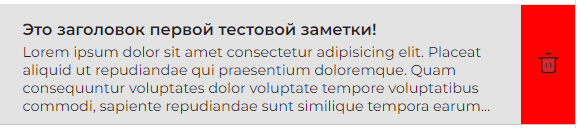

# Приложение "Заметки"

## [Git pages](https://poshalim.github.io/notes)

## Технологии и практики, которые были применены
* Vue.js, vueX 
* SCSS
* БЭМ
* Адаптивная верстка
* gulp

---

## Что было реализовано

* Создание заметок в приложении

* Вывод списка существующих заметок

<br>
* Сохранение заметок и настроек пользователя между сеансами с помощью локального хранилища, кнопка "Сохранить" будет активна только когда пользователь заполнит заголовок и текст

<br>
* Возможность редактирования любой заметки из списка, если не указано одно из полей, отображается ошибка с просьбой заполнить пустое поле

<br>
* Удаление заметок

<br>
* Вставка, удаление и просмотр картинок из заметок. Есть возможность открыть изображение нажав на него. При попытке вставить файл любого другого формата, кроме изображения, пользователю будет выведено диалоговое окно с информацией

<br>
* Возможность выделять текст курсивом, жирным
* Возможность изменить шрифт и размер текста

<br>
* Валидация при создании/изменении заметки. Кнопка добавления становится не доступна после первого нажатия и открытия новой заметки, пока пользователь не заполнит данные или не перейдет в другую заметку, кнопка будет не доступна.

---
## Project setup
```
npm install
```

### Compiles and hot-reloads for development
```
npm run serve
```

### Compiles and minifies for production
```
npm run build
```

---
## Связь
[](https://vk.com/id274314538) [](https://t.me/kazancev)
